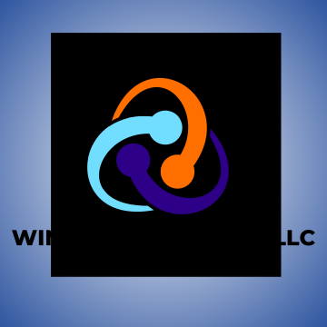

# JourneyApp.me

### What is "JourneyApp.me"?

> _"The perfect companion for your introspective journey. Ignite your creativity while keeping your thoughts organized and your memories accessible at the touch of a finger."_

**JourneyApp.me** is a journaling app written entirely in Swift for iOS. It provides users with the ability to create an account, write journal entries with advanced markdown (headings, lists, checkboxes, bold, italic, strikethrough, code, colored text, nested tokens, etc.), images, locations, and tags. The entries all include a date, and can be searched and filtered with optimized search algorithms as well as custom tags created by the user. Users are able to log in on other devices and still maintain access to their data (all data is stored securely on a server and only accessible to the user who created it), and all entries are able to be downloaded to the device for offline viewing and editing. Entries that are created or edited while the user is offline will be stored on the device until a network connection is established again, at which point the data will be sent to the server and stored. When a user has logged in, a session is created and a JSON Web Token is stored on the device which allows the user to remain logged in for a configurable amount of time, but it's defaulted to 7 days and is revoked upon clicking to logout.

## Table of Contents

- [Contact info](#contact-info)
- [Features](#features)
- [Demo](#demo)
- [Getting started](#getting-started)
- [Usage](#usage)
- [Documentation](#documentation)
- [Technologies](#technologies)
- [License](#license)

## Contact info

**Developed by:** Mitchell Wintrow

**Email**: owner@winapps.io, mitchellwintrow@gmail.com

## Features

- 🔒 Secure user authentication
- 🖊️ Advanced markdown parser
- 📸 Add photos or take new photos and add them to your entries
- 📍 Add locations to your entries
- 🏷️ Add custom tags for better organization and optimize search filters
- 🕸️ Sign in and access your data across devices
- 📲 Download entries for offline viewing
- ⬆️ Create entries offline that are uploaded when connection returns

## Demo

**Quick Walkthrough Demo**

<!--  -->

More demos will be added soon... Thanks for your patience!

## Getting Started

Instructions for getting started will be added soon... Thanks for your patience!

## Usage

Instructions for the usage of this app will be added soon... Thanks for your patience!

**Markdown Syntax (In App)**

- Main Heading: `#` at the beginning of a new line
- Subheading: `##` at the beginning of a new line
- Bulleted List Item: `- ` at the beginning of a new line
- Unchecked Checkbox: `- [ ] ` at the beginning of a new line
- Bold Text: `*` wrapped around the text you want to be bold
- Italic Text: `_` wrapped around the text you want to be italicized
- Underline Text: `~` wrapped around the text you want to be underlined
- Strikethrough Text: `-` wrapped around the text you want to be underlined
- Inline Code: `` ` `` wrapped around the code
- Colored Text Example: `{color: red}This text will be red.{color}`
- Nested Tokens Example: `*This is bold and ~underlined~.*`

More markdown syntax customizations coming soon...

## Documentation

You can find the official **JourneyApp.me** documentation here:

[Official **JourneyApp.me** Documentation](https://vigorous-helicona-f1e.notion.site/My-Journey-Official-Documentation-18426f695b8e805ab8efc17f6634877d)

## Technologies

**Languages**

**OS Platforms**

**IDEs & Text Editors**

**Design**

**Documentation**

**Version Control**

**Producer & Developer**

[![WinApps Solutions LLC](https://img.shields.io/badge/WinApps-%232f56a0.svg?logo=data:image/png;base64,iVBORw0KGgoAAAANSUhEUgAAABwAAAAcCAMAAABF0y+mAAAACXBIWXMAAAk6AAAJOgHwZJJKAAACB1BMVEVHcEz////+/v79/f3+/v7+/v7////////////7+/v+/v78/Pz+/v79/f39/f39/f37+/v8/Pz9/f3+/v7+/v7+/v7+/v79/f38/Pz+/v7+/v7+/v7+/v7+/v7+/v7+/v7+/v7+/v739/f9/f34+Pj5+fn5+fn5+fn7+/v7+/v7+/v7+/v7+/v8/Pz8/Pzl5eX8/Pz9/f39/f3x8fH8/Pz+/v7+/v7+/v79/f39/f3+/v7+/v79/f39/f39/f39/f39/f39/f38/Pz+/v7+/v719fX19fX+/v7+/v78/Pz9/f39/f38/Pz9/f3p6en39/f29vb39/f39/f39/f39/f39/f+/v66urr+/v79/f38/Pz9/f39/f38/Pz9/f35+fn5+fn5+fn4+Pj4+Pj+/v77+/v7+/vu7u77+/v6+vr7+/v7+/v7+/v6+vrLy8v6+vr6+vru7u7j4+P7+/v8/Pz8/Pz9/f39/f39/f38/Pz8/Pzx8fH+/v7+/v7a2trz8/Pb29v+/v7+/v7+/v7n5+fz8/P+/v7+/v7+/v7+/v7+/v7+/v7+/v7+/v7+/v7+/v7+/v7+/v7+/v79/f39/f39/f3+/v7+/v7+/v7+/v7+/v79/f39/f39/f39/f39/f38/Pz9/f39/f39/f39/f39/f39/f39/f3+/v7+/v7+/v7+/v7+/v48I/X5AAAArHRSTlMAA/oDBfn99wEBvZfRSHtYAnBqbuvI48KJ2ebsxfLdvqJ/E2kBHSAPPTE7DxNeNwVsT1sGJkD06byZwc6ioce5kIyBurAMC0ddE39lZ0QDGx0XGBURBiMBBiNGUgYZBCQJGRIXdnAKATcpRGIeFgEyLwQDODUsd3gvMCAIUzEDDAF6fV8BCoqc5a+rzJCPtpue1vGGnbLV27WJ4J+3z8zSiu2wpbq0q6mh0t64yjchRwAABL1pVFh0WE1MOmNvbS5hZG9iZS54bXAAAAAAADw/eHBhY2tldCBiZWdpbj0n77u/JyBpZD0nVzVNME1wQ2VoaUh6cmVTek5UY3prYzlkJz8+Cjx4OnhtcG1ldGEgeG1sbnM6eD0nYWRvYmU6bnM6bWV0YS8nPgo8cmRmOlJERiB4bWxuczpyZGY9J2h0dHA6Ly93d3cudzMub3JnLzE5OTkvMDIvMjItcmRmLXN5bnRheC1ucyMnPgoKIDxyZGY6RGVzY3JpcHRpb24gcmRmOmFib3V0PScnCiAgeG1sbnM6QXR0cmliPSdodHRwOi8vbnMuYXR0cmlidXRpb24uY29tL2Fkcy8xLjAvJz4KICA8QXR0cmliOkFkcz4KICAgPHJkZjpTZXE+CiAgICA8cmRmOmxpIHJkZjpwYXJzZVR5cGU9J1Jlc291cmNlJz4KICAgICA8QXR0cmliOkNyZWF0ZWQ+MjAyNS0wMi0xMDwvQXR0cmliOkNyZWF0ZWQ+CiAgICAgPEF0dHJpYjpFeHRJZD5kY2RmNDhiOC03ODRiLTQ3OWEtYjA1ZS05MjNkM2I1MzM1ZmI8L0F0dHJpYjpFeHRJZD4KICAgICA8QXR0cmliOkZiSWQ+NTI1MjY1OTE0MTc5NTgwPC9BdHRyaWI6RmJJZD4KICAgICA8QXR0cmliOlRvdWNoVHlwZT4yPC9BdHRyaWI6VG91Y2hUeXBlPgogICAgPC9yZGY6bGk+CiAgIDwvcmRmOlNlcT4KICA8L0F0dHJpYjpBZHM+CiA8L3JkZjpEZXNjcmlwdGlvbj4KCiA8cmRmOkRlc2NyaXB0aW9uIHJkZjphYm91dD0nJwogIHhtbG5zOmRjPSdodHRwOi8vcHVybC5vcmcvZGMvZWxlbWVudHMvMS4xLyc+CiAgPGRjOnRpdGxlPgogICA8cmRmOkFsdD4KICAgIDxyZGY6bGkgeG1sOmxhbmc9J3gtZGVmYXVsdCc+Q29weSBvZiBXaW5BcHBzX0JhZGdlX1doaXRlIC0gMTwvcmRmOmxpPgogICA8L3JkZjpBbHQ+CiAgPC9kYzp0aXRsZT4KIDwvcmRmOkRlc2NyaXB0aW9uPgoKIDxyZGY6RGVzY3JpcHRpb24gcmRmOmFib3V0PScnCiAgeG1sbnM6cGRmPSdodHRwOi8vbnMuYWRvYmUuY29tL3BkZi8xLjMvJz4KICA8cGRmOkF1dGhvcj5NaXRjaCBXaW50cm93PC9wZGY6QXV0aG9yPgogPC9yZGY6RGVzY3JpcHRpb24+CgogPHJkZjpEZXNjcmlwdGlvbiByZGY6YWJvdXQ9JycKICB4bWxuczp4bXA9J2h0dHA6Ly9ucy5hZG9iZS5jb20veGFwLzEuMC8nPgogIDx4bXA6Q3JlYXRvclRvb2w+Q2FudmEgZG9jPURBR2V2a2dwblBBIHVzZXI9VUFGQXVyOXdYaDAgYnJhbmQ9QkFGQXVwTnhiSm8gdGVtcGxhdGU9PC94bXA6Q3JlYXRvclRvb2w+CiA8L3JkZjpEZXNjcmlwdGlvbj4KPC9yZGY6UkRGPgo8L3g6eG1wbWV0YT4KPD94cGFja2V0IGVuZD0ncic/PupbsSAAAAIcSURBVCgVVVIHWxNBEH13Ry7BJHIBkpACCSJKVUBIAlgAsfeO7eyKXexiwdh7V1TsXXk/0tk08d337c1OeVN2gDwsV07SpuZVhb8B1Lk9nnn7dgBWQZsVDKwK0hEKk46emRDPCTBQz8il/ThweT75fsp/sRZqmTqWdf5FfrgyIU7Ej1GgqNjQigAP+QlawWyjpXIn7BxZK03HNBQXrCOfOzJyw5do74KrVeTZQk0WBn0Hz32NRb/pJIOIk/15Xun50HfRKui6k3Vp8neBFBWiNZVNDp1tZeSf1VmrC25lcoxfu/5DIsldt8jxvlKV1cBhOsnq6eI6a5JE+yDn7fOJNarg3eXknfa1cX/8CG4sWnwBw06TLYj9VDWVksklR1WdocZMoqU0E7Xo4LDcUqQXnXRKncuApoquhMkemUf5ZGAgxLvAPalSZxqNHmFgYJ2Mq/++pAyzBFhOU9pYgRph0GW0toYHYeBmgJvhwmwJSK5Hb4ZhDjQDD5ObAD83qolvqTQZx1bpVKf0aONRlRSUFlpbvufSbh9eCMPLldiG7ewU4x52A7aFi6NC+XjodFmrKFUTxyGdNvOJXAYwgxIbqFGj2uD1062SWfDxqVc0OPFMDVJ/FesaJVNDmfd2oaGbkddvqsua50rGLNwnVaBAZli/dywYfdeGklRElvPt2Kl/y2vkl108m84Mti8UkzxJHpatWZZmIecmksJfW1eka4cCl0kAAAAASUVORK5CYII=&style=flat&labelColor=%232f56a0)](https://winapps.io/products)
[![Mitchell Wintrow](https://img.shields.io/badge/Mitchell_Wintrow-%23ff6f00.svg?logo=data:image/png;base64,iVBORw0KGgoAAAANSUhEUgAAABwAAAAcCAMAAABF0y+mAAAACXBIWXMAAAk6AAAJOgHwZJJKAAACB1BMVEVHcEz////+/v79/f3+/v7+/v7////////////7+/v+/v78/Pz+/v79/f39/f39/f37+/v8/Pz9/f3+/v7+/v7+/v7+/v79/f38/Pz+/v7+/v7+/v7+/v7+/v7+/v7+/v7+/v7+/v739/f9/f34+Pj5+fn5+fn5+fn7+/v7+/v7+/v7+/v7+/v8/Pz8/Pzl5eX8/Pz9/f39/f3x8fH8/Pz+/v7+/v7+/v79/f39/f3+/v7+/v79/f39/f39/f39/f39/f39/f38/Pz+/v7+/v719fX19fX+/v7+/v78/Pz9/f39/f38/Pz9/f3p6en39/f29vb39/f39/f39/f39/f39/f+/v66urr+/v79/f38/Pz9/f39/f38/Pz9/f35+fn5+fn5+fn4+Pj4+Pj+/v77+/v7+/vu7u77+/v6+vr7+/v7+/v7+/v6+vrLy8v6+vr6+vru7u7j4+P7+/v8/Pz8/Pz9/f39/f39/f38/Pz8/Pzx8fH+/v7+/v7a2trz8/Pb29v+/v7+/v7+/v7n5+fz8/P+/v7+/v7+/v7+/v7+/v7+/v7+/v7+/v7+/v7+/v7+/v7+/v7+/v79/f39/f39/f3+/v7+/v7+/v7+/v7+/v79/f39/f39/f39/f39/f38/Pz9/f39/f39/f39/f39/f39/f39/f3+/v7+/v7+/v7+/v7+/v48I/X5AAAArHRSTlMAA/oDBfn99wEBvZfRSHtYAnBqbuvI48KJ2ebsxfLdvqJ/E2kBHSAPPTE7DxNeNwVsT1sGJkD06byZwc6ioce5kIyBurAMC0ddE39lZ0QDGx0XGBURBiMBBiNGUgYZBCQJGRIXdnAKATcpRGIeFgEyLwQDODUsd3gvMCAIUzEDDAF6fV8BCoqc5a+rzJCPtpue1vGGnbLV27WJ4J+3z8zSiu2wpbq0q6mh0t64yjchRwAABL1pVFh0WE1MOmNvbS5hZG9iZS54bXAAAAAAADw/eHBhY2tldCBiZWdpbj0n77u/JyBpZD0nVzVNME1wQ2VoaUh6cmVTek5UY3prYzlkJz8+Cjx4OnhtcG1ldGEgeG1sbnM6eD0nYWRvYmU6bnM6bWV0YS8nPgo8cmRmOlJERiB4bWxuczpyZGY9J2h0dHA6Ly93d3cudzMub3JnLzE5OTkvMDIvMjItcmRmLXN5bnRheC1ucyMnPgoKIDxyZGY6RGVzY3JpcHRpb24gcmRmOmFib3V0PScnCiAgeG1sbnM6QXR0cmliPSdodHRwOi8vbnMuYXR0cmlidXRpb24uY29tL2Fkcy8xLjAvJz4KICA8QXR0cmliOkFkcz4KICAgPHJkZjpTZXE+CiAgICA8cmRmOmxpIHJkZjpwYXJzZVR5cGU9J1Jlc291cmNlJz4KICAgICA8QXR0cmliOkNyZWF0ZWQ+MjAyNS0wMi0xMDwvQXR0cmliOkNyZWF0ZWQ+CiAgICAgPEF0dHJpYjpFeHRJZD5kY2RmNDhiOC03ODRiLTQ3OWEtYjA1ZS05MjNkM2I1MzM1ZmI8L0F0dHJpYjpFeHRJZD4KICAgICA8QXR0cmliOkZiSWQ+NTI1MjY1OTE0MTc5NTgwPC9BdHRyaWI6RmJJZD4KICAgICA8QXR0cmliOlRvdWNoVHlwZT4yPC9BdHRyaWI6VG91Y2hUeXBlPgogICAgPC9yZGY6bGk+CiAgIDwvcmRmOlNlcT4KICA8L0F0dHJpYjpBZHM+CiA8L3JkZjpEZXNjcmlwdGlvbj4KCiA8cmRmOkRlc2NyaXB0aW9uIHJkZjphYm91dD0nJwogIHhtbG5zOmRjPSdodHRwOi8vcHVybC5vcmcvZGMvZWxlbWVudHMvMS4xLyc+CiAgPGRjOnRpdGxlPgogICA8cmRmOkFsdD4KICAgIDxyZGY6bGkgeG1sOmxhbmc9J3gtZGVmYXVsdCc+Q29weSBvZiBXaW5BcHBzX0JhZGdlX1doaXRlIC0gMTwvcmRmOmxpPgogICA8L3JkZjpBbHQ+CiAgPC9kYzp0aXRsZT4KIDwvcmRmOkRlc2NyaXB0aW9uPgoKIDxyZGY6RGVzY3JpcHRpb24gcmRmOmFib3V0PScnCiAgeG1sbnM6cGRmPSdodHRwOi8vbnMuYWRvYmUuY29tL3BkZi8xLjMvJz4KICA8cGRmOkF1dGhvcj5NaXRjaCBXaW50cm93PC9wZGY6QXV0aG9yPgogPC9yZGY6RGVzY3JpcHRpb24+CgogPHJkZjpEZXNjcmlwdGlvbiByZGY6YWJvdXQ9JycKICB4bWxuczp4bXA9J2h0dHA6Ly9ucy5hZG9iZS5jb20veGFwLzEuMC8nPgogIDx4bXA6Q3JlYXRvclRvb2w+Q2FudmEgZG9jPURBR2V2a2dwblBBIHVzZXI9VUFGQXVyOXdYaDAgYnJhbmQ9QkFGQXVwTnhiSm8gdGVtcGxhdGU9PC94bXA6Q3JlYXRvclRvb2w+CiA8L3JkZjpEZXNjcmlwdGlvbj4KPC9yZGY6UkRGPgo8L3g6eG1wbWV0YT4KPD94cGFja2V0IGVuZD0ncic/PupbsSAAAAIcSURBVCgVVVIHWxNBEH13Ry7BJHIBkpACCSJKVUBIAlgAsfeO7eyKXexiwdh7V1TsXXk/0tk08d337c1OeVN2gDwsV07SpuZVhb8B1Lk9nnn7dgBWQZsVDKwK0hEKk46emRDPCTBQz8il/ThweT75fsp/sRZqmTqWdf5FfrgyIU7Ej1GgqNjQigAP+QlawWyjpXIn7BxZK03HNBQXrCOfOzJyw5do74KrVeTZQk0WBn0Hz32NRb/pJIOIk/15Xun50HfRKui6k3Vp8neBFBWiNZVNDp1tZeSf1VmrC25lcoxfu/5DIsldt8jxvlKV1cBhOsnq6eI6a5JE+yDn7fOJNarg3eXknfa1cX/8CG4sWnwBw06TLYj9VDWVksklR1WdocZMoqU0E7Xo4LDcUqQXnXRKncuApoquhMkemUf5ZGAgxLvAPalSZxqNHmFgYJ2Mq/++pAyzBFhOU9pYgRph0GW0toYHYeBmgJvhwmwJSK5Hb4ZhDjQDD5ObAD83qolvqTQZx1bpVKf0aONRlRSUFlpbvufSbh9eCMPLldiG7ewU4x52A7aFi6NC+XjodFmrKFUTxyGdNvOJXAYwgxIbqFGj2uD1062SWfDxqVc0OPFMDVJ/FesaJVNDmfd2oaGbkddvqsua50rGLNwnVaBAZli/dywYfdeGklRElvPt2Kl/y2vkl108m84Mti8UkzxJHpatWZZmIecmksJfW1eka4cCl0kAAAAASUVORK5CYII=&style=flat)](https://winapps.io/about/mitchell-wintrow)

## License

This project is licensed under the **Creative Commons Attribution-NonCommercial-NoDerivatives 4.0 International License**.

- You can view and share this code for **non-commercial purposes** as long as proper credit is given.
- **Forking, modifications, or derivative works are not allowed.**

For the full license text, visit [Creative Commons License](https://creativecommons.org/licenses/by-nc-nd/4.0/legalcode).

---

This product is developed and owned by [WinApps Solutions LLC ©2024](https://winapps.io)

